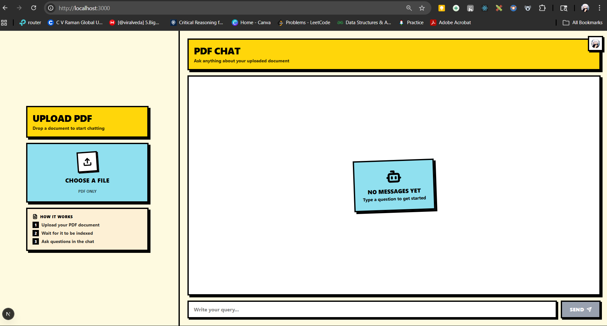
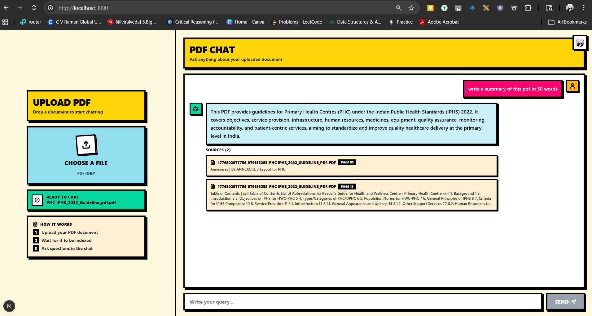

# VectorChat — RAG Chatbot for PDFs

Chat with your PDF documents. Upload a file, ask questions, and get answers grounded in the document's content using Retrieval-Augmented Generation (RAG).

## Tech Stack

- **Frontend**: Next.js 16, React 19, Tailwind CSS v4, Clerk (auth)
- **Backend**: Express, BullMQ (job queue), LangChain
- **Vector DB**: Qdrant
- **Queue / Cache**: Redis (Valkey)
- **LLM**: OpenAI (embeddings + chat completions)

## How It Works

- **Extract Text from PDFs**: Use LangChain's `PDFLoader` (built on `pdf-parse`) to extract text from uploaded PDFs, page level chunking.
- **Queue Ingestion Jobs**: Offload PDF processing to a BullMQ background worker backed by Redis, so uploads stay responsive.
- **Build a Vector Store**: Embed each page with OpenAI's `text-embedding-3-small` and store the chunks in Qdrant.
- **Retrieve Relevant Context**: Embed the user's query with the same model and fetch the top-k most similar chunks from Qdrant.
- **Generate Responses**: Inject the retrieved document into a system prompt and use OpenAI's `gpt-4.1` to generate a grounded answer, returned alongside source citations.

## Prerequisites

- [Node.js](https://nodejs.org/) 20.6 or newer
- [Docker](https://www.docker.com/) (for Qdrant + Redis)
- An [OpenAI API key](https://platform.openai.com/api-keys)
- A [Clerk](https://clerk.com/) account for authentication

## Setup

### 1. Clone the repository

```bash
git clone https://github.com/xabhilash/VectorChat.git
cd VectorChat
```

### 2. Start Qdrant and Redis

From the project root:

```bash
docker compose up -d
```

This starts:
- **Qdrant** (vector database) on `localhost:6333`
- **Valkey** (Redis-compatible queue) on `localhost:6379`

### 3. Configure the backend

```bash
cd server
npm install
```

Create a `.env` file in `server/` with:

```bash
OPENAI_API_KEY=open_api_key

PORT=4000

QDRANT_URL=http://localhost:6333
QDRANT_COLLECTION=langchainjs-testing

REDIS_HOST=localhost
REDIS_PORT=6379
```

### 4. Configure the frontend

```bash
cd ../client
npm install
```

Create a `.env` file in `client/` with your Clerk keys:

```bash
NEXT_PUBLIC_CLERK_PUBLISHABLE_KEY=
CLERK_SECRET_KEY=
```

Get these from the [Clerk Dashboard](https://dashboard.clerk.com/).

## Running the app

You'll need **three terminals** running at the same time.

### Terminal 1 — API server

```bash
cd server
npm run dev
```

Runs the Express API on `http://localhost:4000`.

### Terminal 2 — Background worker

```bash
cd server
npm run dev:worker
```

Processes uploaded PDFs: parses them, embeds the chunks, and stores vectors in Qdrant.

### Terminal 3 — Frontend

```bash
cd client
npm run dev
```

Opens the app at `http://localhost:3000`

## Project structure

```
rag-chatbot/
├── client/              # Next.js frontend
│   ├── app/             # App router pages + layout
│   └── components/      # Chat + file upload UI
├── server/              # Express API + BullMQ worker
│   ├── index.js         # HTTP server (upload + chat endpoints)
│   ├── worker.js        # PDF parsing + embedding worker
│   └── uploads/         # Uploaded PDFs (gitignored)
└── docker-compose.yml   # Qdrant + Valkey services
```






## Abhilash Mohapatra
